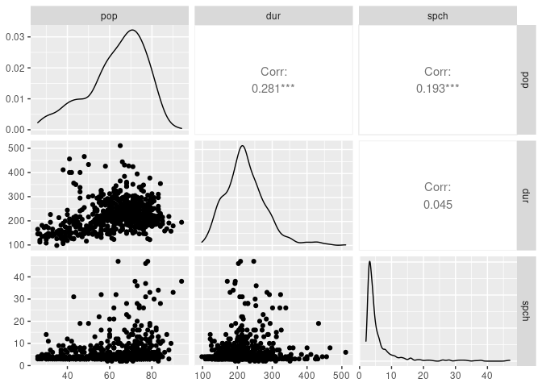

Activity 3 - MLR
================

``` r
library(tidyverse)
```

    ## ── Attaching packages ─────────────────────────────────────── tidyverse 1.3.2 ──
    ## ✔ ggplot2 3.3.6     ✔ purrr   0.3.4
    ## ✔ tibble  3.1.8     ✔ dplyr   1.0.9
    ## ✔ tidyr   1.2.0     ✔ stringr 1.4.1
    ## ✔ readr   2.1.2     ✔ forcats 0.5.2
    ## ── Conflicts ────────────────────────────────────────── tidyverse_conflicts() ──
    ## ✖ dplyr::filter() masks stats::filter()
    ## ✖ dplyr::lag()    masks stats::lag()

``` r
library(tidymodels)
```

    ## ── Attaching packages ────────────────────────────────────── tidymodels 1.0.0 ──
    ## ✔ broom        1.0.0     ✔ rsample      1.1.0
    ## ✔ dials        1.0.0     ✔ tune         1.0.0
    ## ✔ infer        1.0.4     ✔ workflows    1.0.0
    ## ✔ modeldata    1.0.0     ✔ workflowsets 1.0.0
    ## ✔ parsnip      1.0.1     ✔ yardstick    1.0.0
    ## ✔ recipes      1.0.1     
    ## ── Conflicts ───────────────────────────────────────── tidymodels_conflicts() ──
    ## ✖ scales::discard() masks purrr::discard()
    ## ✖ dplyr::filter()   masks stats::filter()
    ## ✖ recipes::fixed()  masks stringr::fixed()
    ## ✖ dplyr::lag()      masks stats::lag()
    ## ✖ yardstick::spec() masks readr::spec()
    ## ✖ recipes::step()   masks stats::step()
    ## • Learn how to get started at https://www.tidymodels.org/start/

``` r
library(GGally)
```

    ## Registered S3 method overwritten by 'GGally':
    ##   method from   
    ##   +.gg   ggplot2

``` r
music_50s <- read.csv("1950[1].csv")
music_60s <- read.csv("1960[1].csv")
music_70s <- read.csv("1970[1].csv")
music_80s <- read.csv("1980[1].csv")
music_90s <- read.csv("1990[1].csv")
music_00s <- read.csv("2000[1].csv")
music_10s <- read.csv("2010[1].csv")
```

``` r
music <- rbind(music_50s, music_60s, music_70s, music_80s, music_90s, music_00s,
               music_10s)
```

``` r
  music %>% 
    select(pop, bpm, nrgy) %>% 
    ggpairs()
```

<!-- -->

``` r
  music %>% 
    select(pop, bpm, dnce) %>% 
    ggpairs()
```

<!-- -->

``` r
  music %>% 
    select(pop, bpm, dB) %>% 
    ggpairs()
```

<!-- -->

``` r
  music %>% 
    select(pop, bpm, live) %>% 
    ggpairs()
```

<!-- -->

``` r
  music %>% 
    select(pop, bpm, val) %>% 
    ggpairs()
```

<!-- -->

``` r
  music %>% 
    select(pop, bpm, dur) %>% 
    ggpairs()
```

<!-- -->

``` r
  music %>% 
    select(pop, bpm, acous) %>% 
    ggpairs()
```

<!-- -->

``` r
  music %>% 
    select(pop, spch) %>% 
    ggpairs()
```

<!-- -->

``` r
  music %>% 
    select(pop, nrgy, dnce) %>% 
    ggpairs()
```

<!-- -->

``` r
  music %>% 
    select(pop, nrgy, dB) %>% 
    ggpairs()
```

<!-- -->

``` r
  music %>% 
    select(pop, nrgy, live) %>% 
    ggpairs()
```

<!-- -->

``` r
  music %>% 
    select(pop, nrgy, val) %>% 
    ggpairs()
```

<!-- -->

``` r
  music %>% 
    select(pop, nrgy, dur) %>% 
    ggpairs()
```

<!-- -->

``` r
  music %>% 
    select(pop, nrgy, acous) %>% 
    ggpairs()
```

<!-- -->

``` r
  music %>% 
    select(pop, nrgy, spch) %>% 
    ggpairs()
```

<!-- -->

``` r
  music %>% 
    select(pop, dnce, dB) %>% 
    ggpairs()
```

<!-- -->

``` r
  music %>% 
    select(pop, dnce, live) %>% 
    ggpairs()
```

<!-- -->

``` r
  music %>% 
    select(pop, dnce, val) %>% 
    ggpairs()
```

<!-- -->

``` r
  music %>% 
    select(pop, dnce, dur) %>% 
    ggpairs()
```

<!-- -->

``` r
  music %>% 
    select(pop, dnce, acous) %>% 
    ggpairs()
```

<!-- -->

``` r
  music %>% 
    select(pop, dnce, spch) %>% 
    ggpairs()
```

<!-- -->

``` r
  music %>% 
    select(pop, dB, live) %>% 
    ggpairs()
```

<!-- -->

``` r
  music %>% 
    select(pop, dB, val) %>% 
    ggpairs()
```

<!-- -->

``` r
  music %>% 
    select(pop, dB, dur) %>% 
    ggpairs()
```

<!-- -->

``` r
  music %>% 
    select(pop, dB, acous) %>% 
    ggpairs()
```

<!-- -->

``` r
  music %>% 
    select(pop, dB, spch) %>% 
    ggpairs()
```

<!-- -->

``` r
  music %>% 
    select(pop, live, val ) %>% 
    ggpairs()
```

<!-- -->

``` r
  music %>% 
    select(pop, live, dur) %>% 
    ggpairs()
```

<!-- -->

``` r
  music %>% 
    select(pop, live, acous) %>% 
    ggpairs()
```

<!-- -->

``` r
  music %>% 
    select(pop, live, spch) %>% 
    ggpairs()
```

<!-- -->

``` r
  music %>% 
    select(pop, val, dur) %>% 
    ggpairs()
```

<!-- -->

``` r
  music %>% 
    select(pop, val, acous) %>% 
    ggpairs()
```

<!-- -->

``` r
  music %>% 
    select(pop, val, spch) %>% 
    ggpairs()
```

<!-- -->

``` r
  music %>% 
    select(pop, dur, acous) %>% 
    ggpairs()
```

<!-- -->

``` r
  music %>% 
    select(pop, dur, spch) %>% 
    ggpairs()
```

<!-- -->

``` r
  music %>% 
    select(pop, acous, spch) %>% 
    ggpairs()
```

<!-- -->

``` r
  lm_spec <- linear_reg() %>%
  set_mode("regression") %>%
  set_engine("lm")

  lm_spec
```

    ## Linear Regression Model Specification (regression)
    ## 
    ## Computational engine: lm

``` r
  mlr_mod <- lm_spec %>% 
  fit(pop ~ nrgy + dB, data = music)

  tidy(mlr_mod)
```

    ## # A tibble: 3 × 5
    ##   term        estimate std.error statistic  p.value
    ##   <chr>          <dbl>     <dbl>     <dbl>    <dbl>
    ## 1 (Intercept)  73.0       3.33      21.9   1.24e-80
    ## 2 nrgy          0.0190    0.0321     0.593 5.53e- 1
    ## 3 dB            1.29      0.190      6.78  2.69e-11


``` r
music$top.genre <- gsub(".*aus.*|.*brit.*|.*canad.*|.*irish.*|.*italian.*|.*uk.*|.*euro.*|.*german.*|.*merseybeat.*|.*yodeling.*|.*chanson.*|.*belgian.*|.*celtic.*|.*latin.*|.*afro.*|.*bubblegum.*|.*trance.*","international",music$top.genre)
```

``` r
music$top.genre <- gsub(".*pop.*|.*adult standards.*|.*beach.*|.*hollywood.*|.*boy band.*","pop",music$top.genre)
```

``` r
music$top.genre <- gsub(".*rock.*|.*metal.*|.*mellow gold.*|.*punk.*|.*permanent wave.*","rock",music$top.genre)
```

``` r
music$top.genre <- gsub(".*hip-hop.*|.*hip hop.*|.*doo-wop.*|.*soul.*|.*blues.*|.*girl.*|.*bebop.*|.*boogaloo.*|.*jazz.*|.*disco.*|.*r&b.*|.*hi-nrg.*|.*funk.*|.*neo.*|.*house.*|.*big.*|.*rap.*|.*brostep.*|.*complextro.*|.*edm.*", "r&b/hip-hop",music$top.genre)
```

``` r
music$top.genre <- gsub(".*country.*|.*folk.*|.*western.*|.*american.*","country",music$top.genre)
```

``` r
music$international <- ifelse(music$top.genre == 'international', 1, 0)
music$domestic <- ifelse(music$top.genre != 'international', 1, 0)
```

``` r
  # review any visual patterns
music%>% 
  select(pop, dB, nrgy, international) %>% 
  ggpairs()
```

<!-- -->

``` r
#fit the mlr model
lm_spec <- linear_reg() %>%
set_mode("regression") %>%
set_engine("lm")
```

``` r
mlr_mod2 <- lm_spec %>% 
  fit(pop ~ nrgy + dB + international, data = music)

tidy(mlr_mod2)
```

    ## # A tibble: 4 × 5
    ##   term          estimate std.error statistic  p.value
    ##   <chr>            <dbl>     <dbl>     <dbl>    <dbl>
    ## 1 (Intercept)    72.9       3.33      21.9   3.34e-80
    ## 2 nrgy            0.0212    0.0325     0.653 5.14e- 1
    ## 3 dB              1.28      0.191      6.72  3.80e-11
    ## 4 international  -0.650     1.40      -0.465 6.42e- 1


")

``` r
  mlr_mod3<- lm_spec %>% 
  fit(pop ~ nrgy + dB + domestic, data = music)

  tidy(mlr_mod3)
```

    ## # A tibble: 4 × 5
    ##   term        estimate std.error statistic  p.value
    ##   <chr>          <dbl>     <dbl>     <dbl>    <dbl>
    ## 1 (Intercept)  72.2       3.69      19.6   8.68e-68
    ## 2 nrgy          0.0212    0.0325     0.653 5.14e- 1
    ## 3 dB            1.28      0.191      6.72  3.80e-11
    ## 4 domestic      0.650     1.40       0.465 6.42e- 1


")

The parameter for the qualitative variable means that the popularity
score will be 0.65 more if the single is domestic compared to it being
international holding both quantitative variables. Or the popularity
score for the single will be 0.65 less if it is international compared
to domestic holding both quantitative variables.

``` r
music_dom <- music %>% 
  filter(top.genre != 'international')
```

``` r
music_dom$rb <- ifelse(music_dom$top.genre == 'r&b/hip-hop', 1, 0)
music_dom$rock <- ifelse(music_dom$top.genre == 'rock', 1, 0)   
music_dom$country <- ifelse(music_dom$top.genre == 'country', 1, 0)
```

``` r
  mlr_mod_rb<- lm_spec %>% 
  fit(pop ~ nrgy + dB + rb, data = music_dom)

  tidy(mlr_mod_rb)
```

    ## # A tibble: 4 × 5
    ##   term        estimate std.error statistic  p.value
    ##   <chr>          <dbl>     <dbl>     <dbl>    <dbl>
    ## 1 (Intercept)  70.8       3.71      19.1   7.47e-63
    ## 2 nrgy          0.0332    0.0363     0.914 3.61e- 1
    ## 3 dB            1.17      0.209      5.59  3.55e- 8
    ## 4 rb            2.24      1.42       1.58  1.14e- 1


")

The intercept is 70.287 with a 0.033 increase for every unit of energy
and 1.17 for every unit increase of dB. Then the quantitative variable
is saying an r&b song will have 2.242 higher popularity points compared
to a pop song.

``` r
  mlr_mod_rock<- lm_spec %>% 
  fit(pop ~ nrgy + dB + rock, data = music_dom)

  tidy(mlr_mod_rock)
```

    ## # A tibble: 4 × 5
    ##   term         estimate std.error statistic  p.value
    ##   <chr>           <dbl>     <dbl>     <dbl>    <dbl>
    ## 1 (Intercept) 73.7         3.69     20.0    1.63e-67
    ## 2 nrgy        -0.000948    0.0368   -0.0258 9.79e- 1
    ## 3 dB           1.40        0.211     6.64   7.34e-11
    ## 4 rock         5.28        1.22      4.31   1.93e- 5


")

The intercept is 73.743 with a 0.0001 decrease for every unit increase
of energy and increase 1.14 for every unit increase of dB. Then the
quantitative variable is saying an r&b song will have 5.278 higher
popularity points compared to a pop song.

``` r
  mlr_mod_country<- lm_spec %>% 
  fit(pop ~ nrgy + dB + country, data = music_dom)

  tidy(mlr_mod_country)
```

    ## # A tibble: 4 × 5
    ##   term        estimate std.error statistic  p.value
    ##   <chr>          <dbl>     <dbl>     <dbl>    <dbl>
    ## 1 (Intercept)  70.8       3.71       19.1  6.02e-63
    ## 2 nrgy          0.0385    0.0363      1.06 2.90e- 1
    ## 3 dB            1.15      0.211       5.45 7.42e- 8
    ## 4 country      -7.72      4.61       -1.68 9.44e- 2


")

The intercept is 70.797 with a 0.039 increase for every unit increase of
energy and 1.148 for every unit increase of dB. Then the quantitative
variable is saying an r&b song will have 7.722 lower popularity points
compared to a pop song.

``` r
#fit the mlr model
lm_spec <- linear_reg() %>%
set_mode("regression") %>%
set_engine("lm")

int_mod <- lm_spec %>% 
fit(pop ~ dB * rock, data = music_dom)

tidy(int_mod)
```

    ## # A tibble: 4 × 5
    ##   term        estimate std.error statistic   p.value
    ##   <chr>          <dbl>     <dbl>     <dbl>     <dbl>
    ## 1 (Intercept)    75.9      1.45      52.2  1.21e-217
    ## 2 dB              1.67     0.160     10.4  2.04e- 23
    ## 3 rock           -5.50     3.20      -1.72 8.59e-  2
    ## 4 dB:rock        -1.23     0.339     -3.62 3.16e-  4


